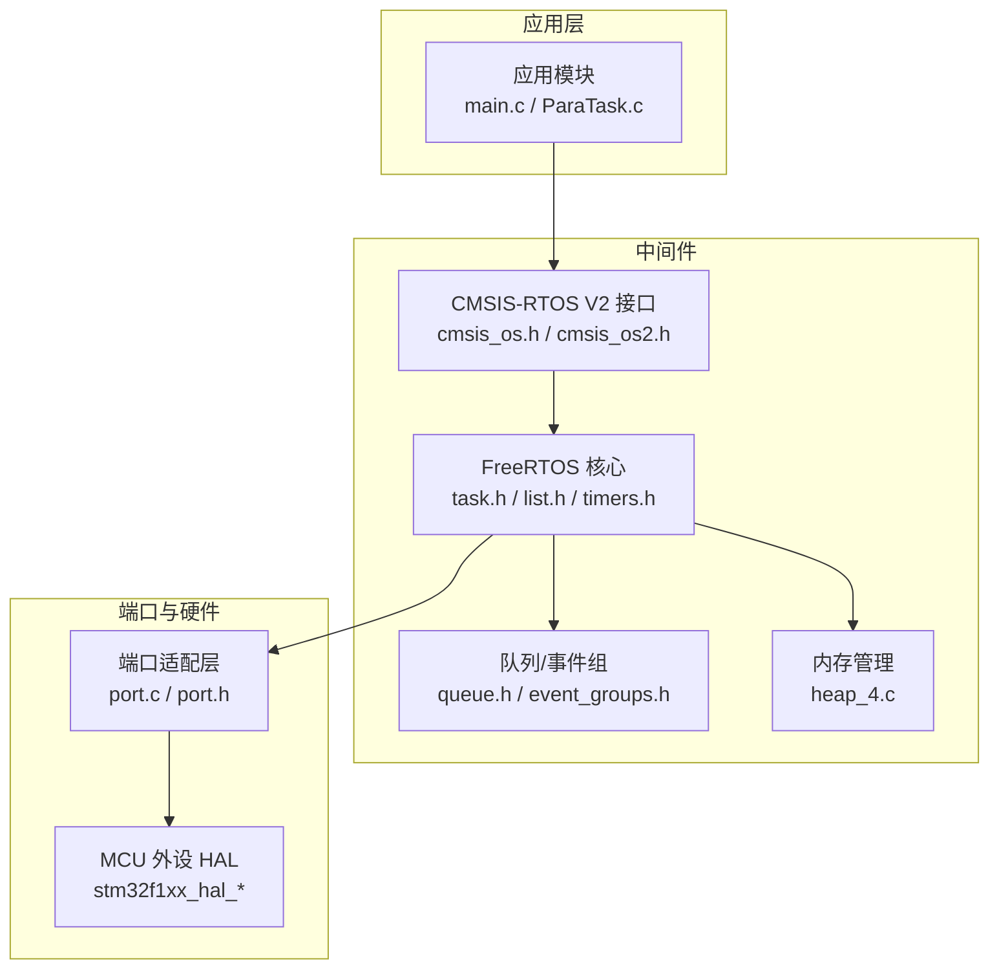
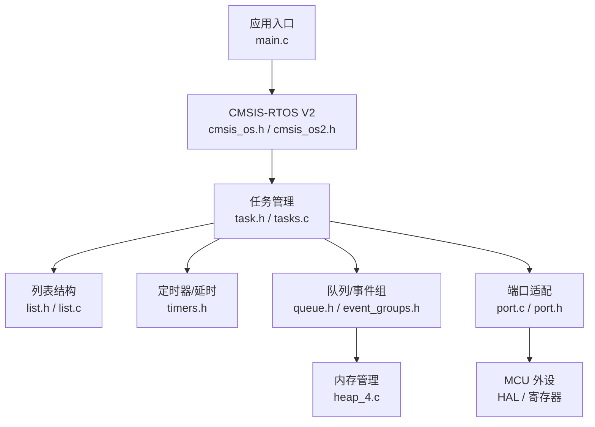
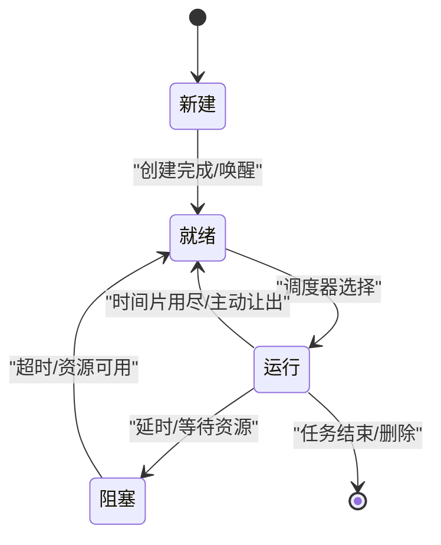
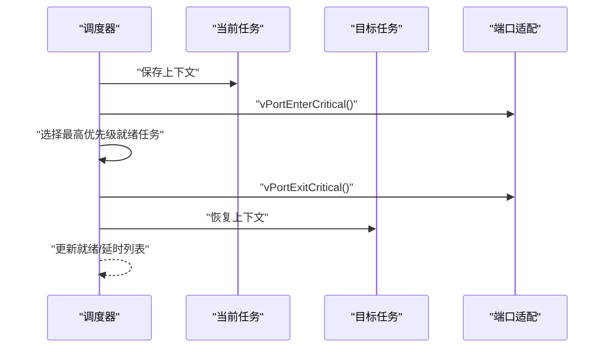
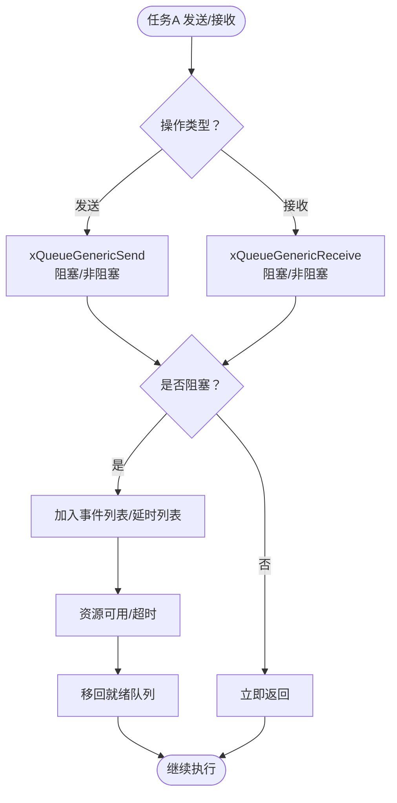
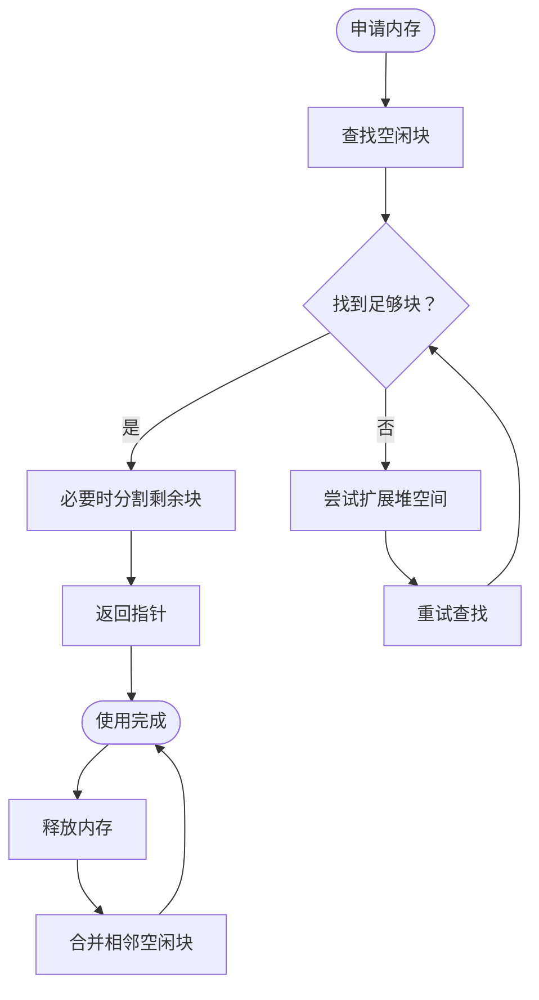
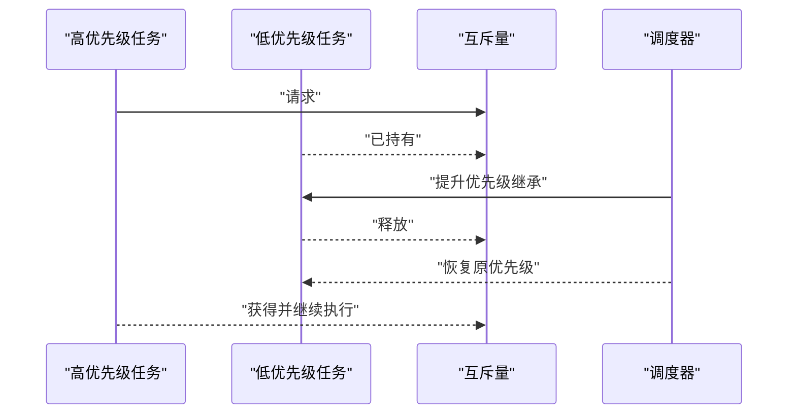
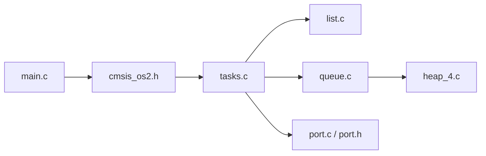

# FreeRTOS基础概念

<cite>
**本文引用的文件**
- [freertos.d](file://DebugConfig/freertos.d)
- [tasks.d](file://DebugConfig/tasks.d)
- [port.d](file://DebugConfig/port.d)
- [queue.d](file://DebugConfig/queue.d)
- [list.d](file://DebugConfig/list.d)
- [freertos.d](file://stik_box/freertos.d)
- [tasks.d](file://stik_box/tasks.d)
- [port.h](file://port/port.h)
- [heap_4.d](file://stik_box/heap_4.d)
- [event_groups.d](file://stik_box/event_groups.d)
- [main.d](file://stik_box/main.d)
- [paratask.d](file://stik_box/paratask.d)
- [stik_box.map](file://stik_box/stik_box.map)
- [test.map](file://DebugConfig/test.map)
</cite>

## 目录
1. [引言](#引言)
2. [项目结构](#项目结构)
3. [核心组件](#核心组件)
4. [架构总览](#架构总览)
5. [详细组件分析](#详细组件分析)
6. [依赖关系分析](#依赖关系分析)
7. [性能考量](#性能考量)
8. [故障排查指南](#故障排查指南)
9. [结论](#结论)
10. [附录](#附录)

## 引言
本指南面向初学者，系统讲解FreeRTOS的基础概念与在嵌入式环境中的应用方式。我们将围绕任务、优先级、时间片轮转、调度器与上下文切换、任务生命周期、队列与事件组、内存管理等主题展开，并结合本仓库中实际编译映射与模块依赖信息，帮助读者建立从理论到实践的完整认知路径。

## 项目结构
该工程采用“应用层 + 中间件（FreeRTOS）+ 硬件抽象层”的分层组织方式。FreeRTOS位于第三方中间件目录，通过CMSIS-RTOS V2接口与应用交互；硬件相关通过端口适配层（port）与寄存器宏封装进行抽象。

图示来源
- [freertos.d:1-67](file://stik_box/freertos.d#L1-L67)
- [tasks.d:1-17](file://stik_box/tasks.d#L1-L17)
- [port.h:1-57](file://port/port.h#L1-L57)
- [heap_4.d:1-14](file://stik_box/heap_4.d#L1-L14)
- [event_groups.d:1-16](file://stik_box/event_groups.d#L1-L16)

章节来源
- [freertos.d:1-67](file://stik_box/freertos.d#L1-L67)
- [main.d:1-73](file://stik_box/main.d#L1-L73)

## 核心组件
- 任务与调度：FreeRTOS的任务模型与列表结构共同支撑调度决策；映射显示任务相关符号在tasks.o中被广泛调用。
- 队列与同步原语：队列用于任务间通信与同步，事件组支持多事件聚合等待；映射显示队列与事件组模块相互协作。
- 内存管理：heap_4.c提供动态内存分配策略，服务于任务栈、队列缓冲等。
- 端口适配：port.h定义了临界区开关、数据类型等底层抽象，port.c实现上下文切换与定时器节拍等。

章节来源
- [tasks.d:1-17](file://stik_box/tasks.d#L1-L17)
- [queue.d:1-16](file://DebugConfig/queue.d#L1-L16)
- [event_groups.d:1-16](file://stik_box/event_groups.d#L1-L16)
- [heap_4.d:1-14](file://stik_box/heap_4.d#L1-L14)
- [port.h:1-57](file://port/port.h#L1-L57)

## 架构总览
下图展示应用、CMSIS-RTOS、FreeRTOS核心、端口与硬件之间的交互关系，以及任务、队列、事件组、内存管理的关键模块。

图示来源
- [freertos.d:1-67](file://stik_box/freertos.d#L1-L67)
- [tasks.d:1-17](file://stik_box/tasks.d#L1-L17)
- [queue.d:1-16](file://DebugConfig/queue.d#L1-L16)
- [event_groups.d:1-16](file://stik_box/event_groups.d#L1-L16)
- [heap_4.d:1-14](file://stik_box/heap_4.d#L1-L14)
- [port.h:1-57](file://port/port.h#L1-L57)

## 详细组件分析

### 任务与优先级
- 任务状态机：新建 → 就绪 → 运行（被调度）→ 阻塞/挂起 → 终止。阻塞常见于延时、等待队列或事件组。
- 优先级继承与反转：高优先级任务等待低优先级任务持有的互斥量时可能发生优先级反转；FreeRTOS通过优先级继承降低反转风险。
- 时间片轮转：在相同优先级的任务之间按时间片轮转，避免高优先级饥饿。

图示来源
- [tasks.d:1-17](file://stik_box/tasks.d#L1-L17)
- [test.map:957-972](file://DebugConfig/test.map#L957-L972)

章节来源
- [tasks.d:1-17](file://stik_box/tasks.d#L1-L17)
- [test.map:957-972](file://DebugConfig/test.map#L957-L972)

### 调度器与上下文切换
- 关键流程：选择最高优先级就绪任务、保存当前上下文、恢复目标任务上下文、更新就绪列表。
- 临界区保护：使用端口提供的进入/退出临界区宏，确保调度原子性。
- 定时器节拍：port.c负责节拍中断处理，驱动延时、超时判断与时间推进。

图示来源
- [port.h:34-35](file://port/port.h#L34-L35)
- [port.d:1-13](file://DebugConfig/port.d#L1-L13)
- [stik_box.map:1140-1199](file://stik_box/stik_box.map#L1140-L1199)

章节来源
- [port.h:34-35](file://port/port.h#L34-L35)
- [port.d:1-13](file://DebugConfig/port.d#L1-L13)
- [stik_box.map:1140-1199](file://stik_box/stik_box.map#L1140-L1199)

### 队列与事件组
- 队列：用于任务间消息传递、信号量、计数信号量、互斥量等；支持阻塞接收/发送与超时控制。
- 事件组：多事件聚合等待，适合多条件组合触发场景。
- 互斥量与递归互斥量：用于共享资源保护，支持优先级继承。

图示来源
- [queue.d:1-16](file://DebugConfig/queue.d#L1-L16)
- [stik_box.map:1140-1202](file://stik_box/stik_box.map#L1140-L1202)

章节来源
- [queue.d:1-16](file://DebugConfig/queue.d#L1-L16)
- [stik_box.map:1140-1202](file://stik_box/stik_box.map#L1140-L1202)

### 内存管理
- heap_4.c提供基于空闲链表的动态分配策略，适用于大多数嵌入式场景。
- 分配/释放接口在队列、任务创建等过程中被调用，保证资源可控。

图示来源
- [heap_4.d:1-14](file://stik_box/heap_4.d#L1-L14)
- [stik_box.map:743-756](file://stik_box/stik_box.map#L743-L756)

章节来源
- [heap_4.d:1-14](file://stik_box/heap_4.d#L1-L14)
- [stik_box.map:743-756](file://stik_box/stik_box.map#L743-L756)

### 优先级继承与反转
- 反转现象：高优先级任务等待低优先级任务持有的互斥量，导致中等优先级任务抢占CPU，形成延迟。
- 解决方案：优先级继承将持有者临时提升至最高请求优先级，缩短持有期，降低反转时间。

图示来源
- [test.map:957-972](file://DebugConfig/test.map#L957-L972)

章节来源
- [test.map:957-972](file://DebugConfig/test.map#L957-L972)

## 依赖关系分析
- 模块耦合：应用通过CMSIS-RTOS调用FreeRTOS；任务管理依赖列表与定时器；队列依赖内存管理；端口适配贯穿调度与外设。
- 映射关系：编译映射显示tasks.o、queue.o、cmsis_os2.o等模块间的相互调用，体现调度、队列与互斥量的协作。

图示来源
- [stik_box.map:1140-1202](file://stik_box/stik_box.map#L1140-L1202)
- [test.map:743-822](file://DebugConfig/test.map#L743-L822)

章节来源
- [stik_box.map:1140-1202](file://stik_box/stik_box.map#L1140-L1202)
- [test.map:743-822](file://DebugConfig/test.map#L743-L822)

## 性能考量
- 优先级设计：合理设置任务优先级，避免过多同优先级任务导致频繁切换。
- 时间片策略：短时间片提高响应性，但会增加切换开销；应根据负载调整。
- 队列长度与超时：过长队列占用内存，过短可能丢失数据；超时需权衡实时性与可靠性。
- 临界区最小化：减少进入/退出临界区的频率与范围，降低调度抖动。
- 内存碎片：heap_4策略简单可靠，注意避免频繁小块分配造成碎片。

## 故障排查指南
- 任务不运行：检查是否处于阻塞状态（延时/等待队列），确认调度器是否启动。
- 死锁/优先级反转：检查互斥量使用与优先级继承逻辑，避免长时间持有共享资源。
- 内存不足：关注队列/任务创建失败与堆扩展日志，优化缓冲大小与生命周期。
- 上下文切换异常：核对端口临界区宏使用与中断优先级配置，确保原子性。

章节来源
- [port.h:34-35](file://port/port.h#L34-L35)
- [stik_box.map:1140-1202](file://stik_box/stik_box.map#L1140-L1202)

## 结论
FreeRTOS以轻量、可移植、确定性为核心，在嵌入式系统中提供了强大的并发与同步能力。通过理解任务生命周期、调度与上下文切换、队列与事件组、内存管理与端口适配，初学者可以构建稳定可靠的实时应用。建议从最小可运行示例开始，逐步引入队列、事件组与互斥量，最终掌握优先级继承与系统优化。

## 附录
- 学习路径建议
  - 第一步：搭建最小工程，创建两个任务，观察上下文切换与时间片轮转。
  - 第二步：引入队列与定时器，实现任务间通信与周期性工作。
  - 第三步：使用事件组与互斥量，掌握同步与资源共享。
  - 第四步：分析映射与日志，定位性能瓶颈与潜在问题。
- 实践建议
  - 使用CMSIS-RTOS封装简化接口，便于移植与调试。
  - 在关键路径使用临界区保护，确保数据一致性。
  - 对内存分配进行统计与监控，避免碎片与泄漏。
  - 借助映射文件梳理模块依赖，快速定位跨模块调用关系。